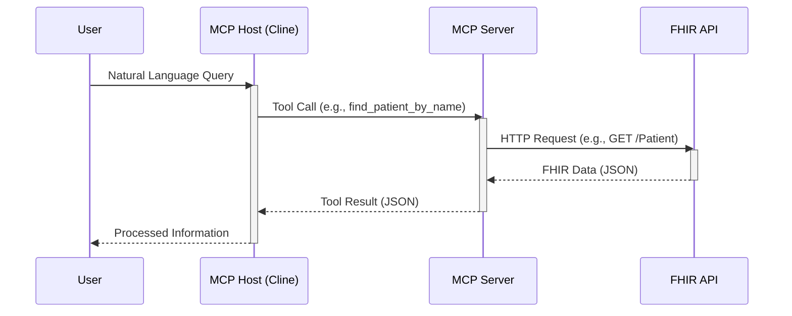

# Building a Healthcare-Specific MCP Server for Cline

I built a Model Context Protocol (MCP) server to query FHIR servers, designed to work with Cline or other MCP hosts. This project allows doctors to interact with a FHIR API using natural language.

[](https://www.youtube.com/watch?v=h1KOCCGPkuo)

## Project Overview

My goal was to create an MCP server that interfaces with a FHIR server to retrieve patient data, medications, observations, and more. FHIR (Fast Healthcare Interoperability Resources) is a standard for healthcare data exchange, and my server makes it accessible through simple, developer-friendly tools. This allows Cline to perform complex queries, such as “list patients named John Smith over 55 on diphenhydramine,” directly within the development environment.

## Installation

1.  **Clone the repository:**
    ```bash
    git clone <repository_url>
    cd <repository_directory>
    ```
    (Replace `<repository_url>` and `<repository_directory>` with the actual GitHub repository details.)

2.  **Create a Virtual Environment**
    ```bash
    python3 -m venv venv
    source venv/bin/activate
    ```
    This will create a virtual environment named `venv` and activate it. You should see `(venv)` in your terminal prompt, indicating the environment is active.

3.  **Install dependencies:**
    Make sure you have Python installed. Then install the required libraries using pip and the `requirements.txt` file:
    ```bash
    pip install -r requirements.txt
    ```

## Key Features

The MCP server includes several healthcare-specific tools, each designed to streamline data retrieval:

|   |   |
|---|---|
|**Tool**|**Description**|
|Find Patient by ID|Retrieves detailed patient information using a unique patient identifier.|
|Find Medication Requests by Patient ID|Fetches all medication requests associated with a specific patient.|
|Find Observations by Patient ID|Retrieves observation records, such as vital signs or lab results, for a patient.|
|Find Patient by Name|Searches for patients by first and last name, returning a list of matches.|

Each tool is implemented as a Python function that sends HTTP GET requests to the FHIR server and returns JSON responses. This setup allows developers to integrate healthcare data into their applications without navigating the complexities of FHIR queries, as Cline manages interactions via the MCP server.

## Implementation Details

The server is built using Python and the requests library, leveraging the FastMCP class from the mcp.server.fastmcp module. Below is an example of the find_patient tool:

```python
from mcp.server.fastmcp import FastMCP
import requests

FHIR_SERVER_URL = "https://hapi.fhir.org/baseR4"

mcp = FastMCP("HAPI-MCP")

@mcp.tool()
def find_patient(patient_id: str) -> dict:
    url = f"{FHIR_SERVER_URL}/Patient/{patient_id}"
    response = requests.get(url)
    return response.json()
```

This pattern is repeated for other tools, with each function targeting the appropriate FHIR endpoint. The server is initialized with a friendly name (“HAPI-MCP”) and runs using a standard input/output transport mechanism, making it compatible with Cline’s workflow.

## Using the Server with Cline

Once the MCP server is running, Cline can call its tools to execute healthcare queries. For example, a developer could instruct Cline to retrieve medication requests for a patient by ID or search for patients by name. Cline’s ability to incorporate context, such as file structures or diagnostic information, enhances its effectiveness in handling these tasks (Why I Use Cline). This integration empowers developers to build healthcare applications more efficiently, leveraging AI to manage data retrieval.

## Adding the HAPI-MCP Server to MCP Hosts

To use the `hapi-mcp-server` with Cline, Claude desktop, Copilot agent, or other MCP hosts, you need to add its configuration to your MCP settings file. The location of this file may vary depending on the specific MCP host you are using, but it is typically a JSON file containing server configurations.

Add the following JSON object under the `"mcpServers"` key in your MCP settings file:

```json
"hapi-mcp-server": {
  "command": "/path/to/server/hapi_mcp/venv/bin/python",
  "args": [
    "/path/to/server/hapi_mcp/hapi-mcp-server.py"
  ],
  "env": {
    "HAPI_MCP_SERVER_HOST": "https://hapi.fhir.org/baseR4"
  },
  "description": "Returns a patient FHIR resources for a given patient ID"
}
```

If the file or the `"mcpServers"` key does not exist, you may need to create them.

After adding this configuration, restart your MCP host to load the new server. The `hapi-mcp-server` should then be available for use.

## Architecture Diagram

Here's a diagram illustrating the interaction between the User, MCP Host (Cline), MCP Server, and the FHIR API:



## Conclusion

This project showcases integrating AI coding assistants with specialized MCP servers to address domain-specific challenges. The source code is available on GitHub, and a video demonstrating the tool in action provides a closer look at its capabilities. By enabling seamless interaction with healthcare data, this MCP server paves the way for more efficient and impactful solutions in healthcare, empowering developers to make a meaningful difference in the industry.
